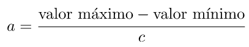

# Estadística Descriptiva

## 🔻 Medidas de tendencia central y dispersión

### Número de clases

El número de clases en estadísticas se refiere a la cantidad de divisiones o intervalos en los que se divide un conjunto de datos al crear un histograma o realizar un análisis de distribución de frecuencias. La ***regla de Sturges***, es una forma común de determinar el número de clases.

- **Regla de Sturges:** La regla de Sturges es una regla empírica utilizada en estadísticas y análisis de datos para determinar el número apropiado de intervalos en un histograma al representar una distribución de datos. La regla de Sturges sugiere que el número óptimo de intervalos (k) en un histograma se puede calcular mediante la siguiente fórmula:

Donde **"ni"** es el número de intervalos, y **"n"** es el número de observaciones en el conjunto de datos. El resultado se redondea al número entero más cercano, ya que el número de intervalos debe ser un número entero.

### Amplitud del intervalo aproximado

La amplitud de intervalo aproximada se refiere al tamaño o la longitud de cada intervalo en un histograma o en un análisis de distribución de frecuencias. En otras palabras, es la distancia entre los límites superior e inferior de cada clase en un histograma.

Para calcular la amplitud del intervalo se usa la siguiente fórmula:

Donde **"c"** es el número de intervalos o clases en que se dividió el conjunto de datos para su análisis.

### Límites inferior y superior

- **Límite Inferior:** El límite inferior es el valor más pequeño o el punto de inicio de un intervalo o clase en un histograma. Representa el valor mínimo que puede estar incluido en ese intervalo. Todos los valores iguales o mayores que el límite inferior, pero menores que el límite superior, se agrupan en ese intervalo. Por lo tanto, el límite inferior establece el punto de partida para la clasificación de datos en un intervalo particular.
- **Límite Superior:** El límite superior es el valor más grande o el punto final de un intervalo o clase en un histograma. Representa el valor máximo que puede estar incluido en ese intervalo. Todos los valores iguales o menores que el límite superior, pero mayores que el límite inferior, se agrupan en ese intervalo. El límite superior define el extremo superior del intervalo y, junto con el límite inferior, delimita el rango de valores incluidos en ese intervalo.

### Frecuencia

La frecuencia consiste en revisar cada uno de los intervalos y captura la cantidad de datos que se encuentran entre esos datos, al final, la suma debe de dar el total de los datos.
